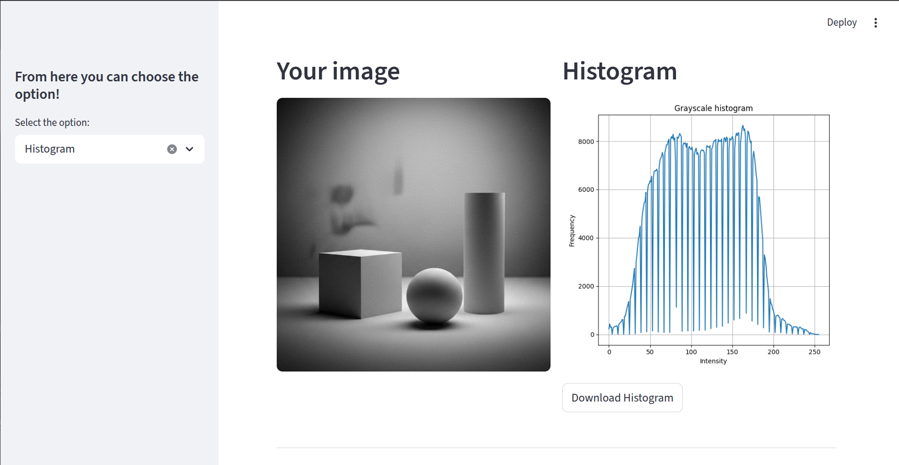
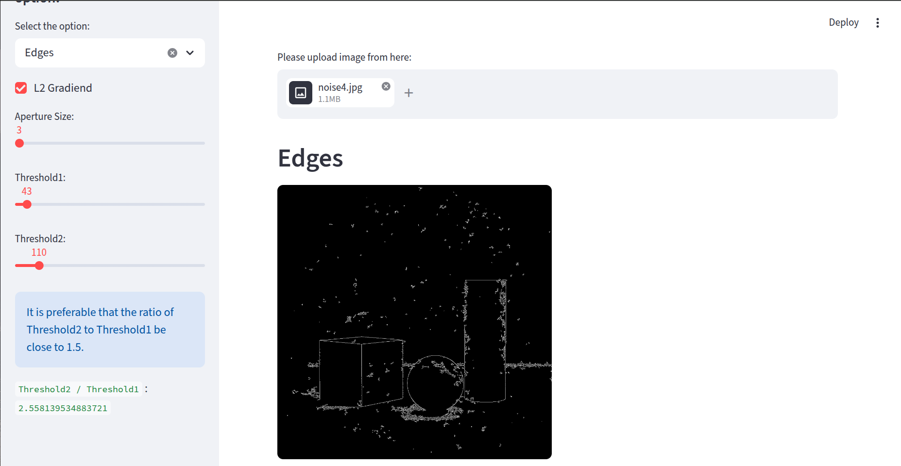

📷 Mini Photo Editor
A modular web-based image processing application built with Streamlit and OpenCV, designed to provide interactive image editing and computer vision operations directly in the browser.

🚀 Overview
Mini Photo Editor is a lightweight yet powerful image processing tool that allows users to upload images and apply various transformations, filters, and computer vision techniques in real-time.

The project is structured using a modular OOP architecture, where each image processing category is implemented as an independent class.

Features:

    Histogram:

        Compute and visualize image histograms
        Download histogram as image
    Transforms:

        Resize (scale ratio control)
        Rotate (angle + scaling)
        Flip (horizontal / vertical / both)
    Filters:

    Normal Blur:

        Gaussian Blur
        Median Blur
        Color Space Conversions
        RGB
        LAB
        HSV
        YCrCb
        GRAY
        HLS
        LUV
    Thresholding:

        Binary Threshold
        Otsu Threshold
        Adaptive Threshold
    Contours Detection:

        Detect contours after thresholding
        Visualize detected boundaries
    Edge Detection:

        Canny Edge Detector
        Adjustable:
        Threshold1
        Threshold2
        Aperture Size
        L2 Gradient option
    Image Blending:

        Alpha blending between two uploaded images

Project Architecture
The application follows a modular object-oriented design:

content_copy
text
mini-photo-editor/
|__ src/
|    │
|    ├── web_ui.py        # Streamlit Web Interface (WebApp class)
|    ├── histogram.py
|    ├── transforms.py
|    ├── filters.py
|    ├── blending.py
|    ├── color_space.py
|    ├── threshold.py
|    ├── edges.py
|    ├── contours.py
|    ├── requirements.txt
└── README.md
Each module encapsulates a specific image processing domain.

⚙️ Installation

python -m venv venv
source venv/bin/activate   # macOS/Linux
venv\Scripts\activate      # Windows

Install dependencies:

    pip install -r requirements.txt

Run the Application:

    python3 main.py

Technologies Used:

    Python 3.x
    Streamlit
    OpenCV (cv2)
    NumPy
    matplotlib
## test images

Educational Value:

    This project demonstrates:

    Modular software architecture
    Object-Oriented Design in Python
    Practical computer vision techniques
    Interactive UI development with Streamlit
    Clean Git-based version control workflow

Future Improvements:

    Add image cropping tool
    Add brightness/contrast adjustment
    Add morphological operations
    Add undo/redo stack
    Add image comparison mode
    Deploy online (Streamlit Cloud)

👨‍💻 Author:

    Ali Asghar

    Computer Engineering Student

Interested in Artificial Intelligence & Educational Technologies.